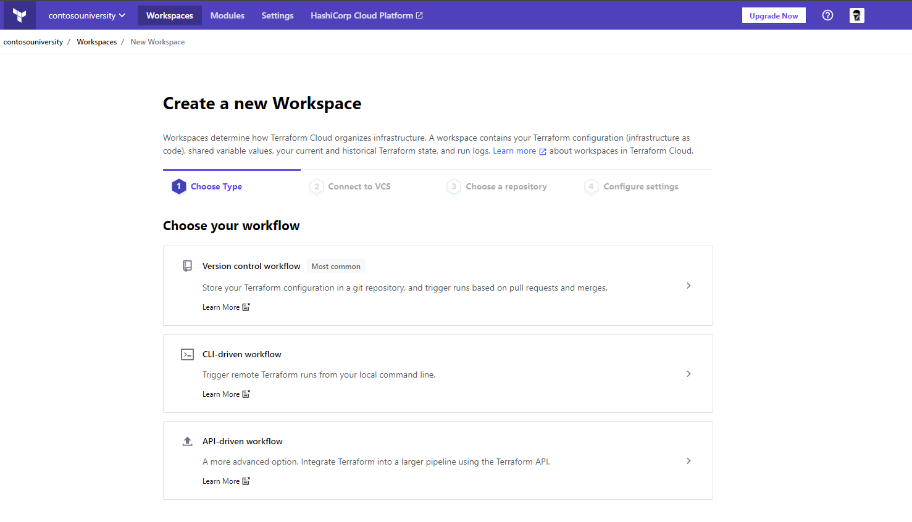

# Getting started with Terraform

## Terraform basics

### Download and Install

- Download terraform from https://www.terraform.io/downloads.html
- Extract the executable and add the folder to your PATH variable
- Open a shell and type `terraform version`
- The basic commands we'll use are:

	- `terraform init`
	- `terraform plan`
	- `terraform apply`
	- `terraform destroy`

- I would also advise you to use the `terraform fmt` command often to ensure your scripts well formatted according to HashiCorp's [style conventions](https://www.terraform.io/docs/configuration/style.html)

### Folder structure

Terrafrom executes on the files within a folder that are named with the `.tf` extension. Here is what a typical folder structure looks like:


```text
.
├── main.tf
├── outputs.tf
└── variables.tf
```

- `main.tf` is where the deployment scripts will be written to
- `outputs.tf` is where the output variables will be defined
- `variables.tf` is where the variables will be defined

Optionally, you can add a `main.auto.tfvars` files to set values for your variables. Defining them here will allow you to avoid passing in variable values on `terraform apply`. More on that [here](https://learn.hashicorp.com/tutorials/terraform/azure-variables). 

### HashiCorp Configuration Language (HCL)

HashiCorp domain specific language for defining infrastructure deployment details. This is especially beneficial for organizations with multi-cloud strategies. 

Authoring HCL is pretty straight-forward and there are tons of example code found on Terraform docs website.

Basic structure of an Azure deployment requires
1. The `azurerm` **provider**
2. An `azurerm_*` **resource**
3. Optionally, `azurerm_*` **data** can be used to import pre-existing resources into your Terraform state file

Here is a sample where we use the `azurerm` provider to deploy a `resource group`

### main.tf

```text
provider "azurerm" {
  version = "=2.37.0"
  features {}
}

resource "azurerm_resource_group" "rg" {
  name     = var.rg_name
  location = var.rg_location
  tags     = var.rg_tags
}
```

In the example above, you can see that the syntax looks a bit like JSON but IMO a little easier to read. 

Providers are required so that Terraform will know which modules it needs to download to execute the deployment. 

> Keep a close eye on provider versions as they are updated constantly to keep up to date with cloud providers. 

> Not all resources are available in azurerm providers. Some deployments may require the use of `azurerm_template_deployment` whereby you can have Terraform execute ARM templates
 
As you define resources, you'll notice they all begin with the `resource` keyword followed by the resource type defined in the `azurerm` provider. In the example above, we are referencing a `azurerm_resource_group` for our Azure resource group deployment and aliasing it as `rg`. These aliases come in handy as we can use it as an object for other resources in the deployment script.

For example, we can add the next bit of HCL code to deploy an Azure Container Registry in our resource group.

```text
resource "azurerm_container_registry" "acr" {
  name                = var.acr_name
  resource_group_name = azurerm_resource_group.rg.name
  location            = azurerm_resource_group.rg.location
  sku                 = var.acr_sku
  admin_enabled       = var.acr_admin_enabled
}
```

As you can see, our `acr` deployment requires a `resource_group_name` and `location` so we can simply reference it from the `rg` resource. 

> In Object Oriented Programming terms, think of `rg` as being an instance of an object

This is pretty much all you need to know to be dangerous with Terraform.

Additional details can be found at the links below
- https://www.terraform.io/docs/configuration/index.html
- https://registry.terraform.io/providers/hashicorp/azurerm/latest/docs

Last but not least, I'd recommend you use [VSCode](https://code.visualstudio.com/Download) as your editor with the [hashicorp.terraform](https://marketplace.visualstudio.com/items?itemName=hashicorp.terraform) extension installed to assist with HCL editing using the Terraform language server.

## Let's go deploy to Azure using Terraform!

Take a look at the following article to understand how Terraform can authenticate to Azure
https://registry.terraform.io/providers/hashicorp/azurerm/latest/docs#authenticating-to-azure

We will simply use [Azure CLI](https://docs.microsoft.com/en-us/cli/azure/install-azure-cli) locally or in [Azure Cloud Shell](https://shell.azure.com)

> Azure Cloud Shell can also be accessed using [Windows Terminal](https://docs.microsoft.com/en-us/windows/terminal/)

1. Open your favorite shell and login to azure-cli
	
	```sh
	az login
	az account show
	
	# if the incorrect subscription is selected, set it using this command
	az account set -s <your_subscription_id>
	```

2. Create a new directory

	```sh
	mkdir terraform-sample
	cd terraform-sample
	```
3. Finding syntax to deploy a resource is as simple as browsing to the docs for `azurerm`, filtering for a resource, copying the example code, and modify as needed. Will deploy a [storage account](https://registry.terraform.io/providers/hashicorp/azurerm/latest/docs/resources/storage_account)

	> When searching for resources to deploy, make sure you are looking at `resources` and not `data`. More on that below when we get into state.

5. Create your variables.tf file and add in the following code:

	```text
	variable "resourcegroupname" {
	  type    = string
	  default = "myresourcegroup11242020x"
	}
	
	variable "location" {
	  type    = string
	  default = "westus2"
	}
	
	variable "storageaccountname" {
	  type    = string
	  default = "mystorageaccount11242020"
	}
	```
	
	> I have default values here so that we don't have to pass in any values on `terraform apply` or use tfvars file (for now)

5. Create your main.tf file and add in the following code:

	```text
	provider "azurerm" {
	  version = "=2.37.0"
	  features {}
	}
	
	resource "azurerm_resource_group" "example" {
	  name     = var.resourcegroupname
	  location = var.location
	}

	resource "azurerm_storage_account" "example" {
	  name                     = var.storageaccountname
	  resource_group_name      = azurerm_resource_group.example.name
	  location                 = azurerm_resource_group.example.location
	  account_tier             = "Standard"
	  account_replication_type = "GRS"

	  tags = {
		environment = "dev"
	  }
	}
	```

6. Since this is the first time we are running the Terraform commands in this directory, we need to issue the `terraform init` command to get the `azurerm` plugins

7. Plan your deployment using `terraform plan` command. Take a look at the output and confirm the resources you intend to deploy

8. Apply changes to your Azure subscription by using the `terraform apply` command. You'll need to type in the word `yes` to confirm the deployment. Optionally, you can use the `terraform --auto-approve` if you do not want to be bothered by the confirmation request

9. Log into the Azure Portal and confirm your resources are deployed then use the `terraform destroy` command to delete.

## State?!?

You'll notice in your working directory that as you deployed your resources, there are new files with `tfstate` in the name 

- `terraform.tfstate`
- `terraform.tfstate.backup`

These files are here because Terraform manages state of your deployment. It will understand what is and what isn't deployed based on your script and will keep that info in these files. 

> If you need to reference resources that were deployed in your Azure subscription outside of Terraform, you can import the details of the resource using `data` modules in the `azurerm` provider.

This is sufficient if you are working alone and keeping the state files on your machine. If you need to work as a team, you'll need a remote state management solution. 

You have a few options here:

1. Use [Azure Storage](https://docs.microsoft.com/en-us/azure/developer/terraform/store-state-in-azure-storage) to keep track of state files
2. Use Terraform Cloud - we'll use this in the next exercise 

https://learn.hashicorp.com/tutorials/terraform/azure-remote?in=terraform/azure-get-started

## Terraform cloud

### Check out the official **Get Started - Terraform Cloud** tutorial [here](https://learn.hashicorp.com/collections/terraform/cloud-get-started)

1. If you don't already have an account on [Terraform Cloud](https://app.terraform.io/), create one
2. Login to Terraform Cloud
3. Create an [organization](https://app.terraform.io/app/organizations/new)
4. Create a workspace

	- Choose a workflow - let's click "CLI driven workflow" here
	
		
	
5. In order for Terraform Cloud to connect to your Azure subscription, you'll need to create a new service principal and add the object's values as variables in your workspace
6. Create a service principal using Azure CLI

	```sh
	az ad sp create-for-rbac -n tf-operator
	```

7. The output will contain all that you need to configure your workspace variables. Map the values to these specific environment variables in your workspace

	- `ARM_CLIENT_ID`
	- `ARM_CLIENT_SECRET`
	- `ARM_TENANT_ID`
	- `ARM_SUBSCRIPTION_ID`

		

8. Create a new file in your working directory called `backend.tf` and add in the following code

	```text
	terraform {
	  backend "remote" {
		organization = "<your_organization_name>"

		workspaces {
		  name = "<your_workspace_name>"
		}
	  }
	}
	```

9. If you still have tfstate files in your working directory, delete them
11. Now that we added a new backend, we'll need to run `terraform init`
12. Run `terraform plan` and notice it is being run in Terraform Cloud
13. Run `terraform apply` and notice it is being run in Terraform Cloud 
14. In Terraform Cloud, navigate to your workspace, and click on the Runs tab to view results

	

## GitOps

### Check out the official **Automate Terraform with GitHub Actions** tutorial [here](https://learn.hashicorp.com/tutorials/terraform/github-actions)

1. In GitHub, create a new repository, add your .tf files, commit, and push
1. Browse to Terraform Cloud settings and [create a new API token](https://app.terraform.io/app/settings/tokens) for github-actions. 
1. Browse to your GitHub and navigate to Settings.
1. In Settings, click on Secret and add a new Repository secret named `TF_API_TOKEN`
1. Paste in the token you generated in Terraform Cloud

	
	
1. Navigate to Actions and add in the [setup-terraform](https://github.com/marketplace/actions/hashicorp-setup-terraform) action 
1. Make a change to your terraform source code, do a push, and you'll notice the GitHub Action queueing a new plan and apply in Terraform Cloud

## Some Tips

- If using Bash, set an alias for the `terraform` command to something short like `tf` so you don't have to spell out terraform each time

  ```sh
	alias tf=terraform
	```

- Use Hashicorp's `azurerm` provider docs as your guide!
- Always plan to build and use modules as maintaining monolithic deployments in a single `main.tf` file can get overwhelming after a while 
